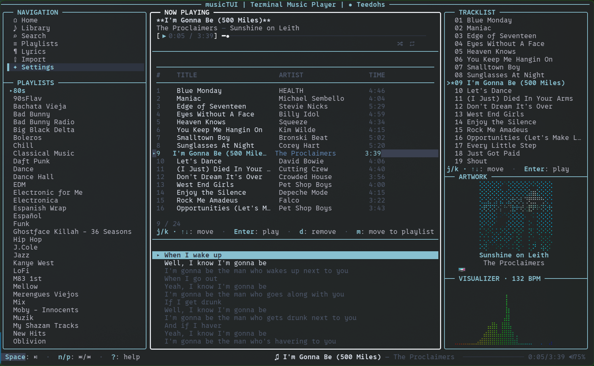

# musicTUI

A terminal-based music player for Spotify. Browse your library, search for music, manage playlists, and stream audio — all from your terminal.




---

## Table of Contents

- [Features](#features)
- [What You Need Before Starting](#what-you-need-before-starting)
- [Installation](#installation)
  - [Download (Recommended)](#download-recommended)
  - [Build from Source](#build-from-source)
- [Setting Up Spotify](#setting-up-spotify)
  - [Step 1: Create a Spotify Developer App](#step-1-create-a-spotify-developer-app)
  - [Step 2: Add Your Account to the App](#step-2-add-your-account-to-the-app)
- [First Launch](#first-launch)
- [Getting Around the App](#getting-around-the-app)
  - [The Screen Layout](#the-screen-layout)
  - [Moving Between Panels](#moving-between-panels)
  - [The Sidebar (Left Panel)](#the-sidebar-left-panel)
- [Playing Music](#playing-music)
  - [Playback Controls](#playback-controls)
  - [The Queue (Right Panel)](#the-queue-right-panel)
  - [Volume](#volume)
  - [Shuffle and Repeat](#shuffle-and-repeat)
- [Browsing Your Library](#browsing-your-library)
- [Searching for Music](#searching-for-music)
  - [How to Search](#how-to-search)
  - [Exploring Results](#exploring-results)
- [Managing Playlists](#managing-playlists)
  - [Viewing Playlists](#viewing-playlists)
  - [Creating a Playlist](#creating-a-playlist)
  - [Editing a Playlist](#editing-a-playlist)
  - [Deleting a Playlist](#deleting-a-playlist)
  - [Adding a Track to a Playlist](#adding-a-track-to-a-playlist)
  - [Removing a Track from a Playlist](#removing-a-track-from-a-playlist)
  - [Moving a Track Between Playlists](#moving-a-track-between-playlists)
  - [Duplicate Playlist Cleanup](#duplicate-playlist-cleanup)
  - [Empty Playlist Cleanup](#empty-playlist-cleanup)
- [Lyrics](#lyrics)
- [Audio Visualizer](#audio-visualizer)
- [Settings](#settings)
- [Media Keys (Linux)](#media-keys-linux)
- [Configuration File](#configuration-file)
- [Keyboard Shortcuts Reference](#keyboard-shortcuts-reference)
- [Troubleshooting](#troubleshooting)
- [Building from Source](#building-from-source-detailed)
- [Testing and Smoke Checks](#testing-and-smoke-checks)
- [Importing from YouTube Music](#importing-from-youtube-music)
- [Roadmap](#roadmap)
- [License](#license)

---

## Features

- **Spotify playback** — stream your library, search the Spotify catalog, and control playback entirely from the terminal (Premium required for audio).
- **Real-time audio visualizer** — a CAVA-style spectrum analyzer (the engine behind the popular "Kurve" desktop widget) that's tightly synced to the **beat and tempo**, with a horizontal rainbow gradient and a live BPM readout. Tunable at runtime — see [Audio Visualizer](#audio-visualizer).
- **Synced lyrics** — line-synced lyrics that scroll with the music, inline or full-screen.
- **Album artwork** — the current cover rendered right in your terminal.
- **Full library & playlist management** — browse, search, and create / edit / delete / reorder playlists, move tracks between them, and clean up duplicate or empty playlists.
- **Library import** — bring your playlists and liked songs over from **YouTube Music** and **Apple Music**.
- **Media-key support** (Linux / D-Bus) plus a fast, fully keyboard-driven UI.
- **Single self-contained binary** — the audio engine is embedded; nothing else to install. Light on resources (~25% of one CPU core at 60fps, ~40 MB RAM).

---

## What You Need Before Starting

1. **A Spotify account** — Free or Premium. Premium is required for audio streaming.
2. **A computer** running Linux, macOS, or Windows.
3. **A terminal** — The built-in terminal app on your computer works fine.

That's it. No programming experience needed.

---

## Installation

### Download (Recommended)

This is the easiest way. You download the app and run it — no compiling, no setup tools.

1. Go to the [Releases page](https://github.com/iamteedoh/musicTUI/releases/latest).
2. Download the file for your system:
   - **Linux**: `musicTUI-linux-amd64.tar.gz`
   - **Mac (Apple Silicon / M1-M4)**: `musicTUI-darwin-arm64.tar.gz`
   - **Mac (Intel)**: `musicTUI-darwin-amd64.tar.gz`
   - **Windows**: `musicTUI-windows-amd64.zip`

3. Extract the downloaded file:

   **Linux / Mac** — open a terminal and run:
   ```
   tar xzf musicTUI-*.tar.gz
   ```

   **Windows** — right-click the `.zip` file and select "Extract All."

4. You will have a single file: `musicTUI` (or `musicTUI.exe` on Windows). The audio engine is embedded inside — no extra files needed.

5. (Optional) Move it to a folder in your system PATH so you can run `musicTUI` from anywhere:

   **Linux / Mac**:
   ```
   mkdir -p ~/.local/bin
   mv musicTUI ~/.local/bin/
   ```

   **Windows**: Move the file to a folder like `C:\Users\YourName\bin\` and add that folder to your PATH in System Settings.

### Build from Source

If you prefer to build the app yourself, see [Building from Source (Detailed)](#building-from-source-detailed) at the bottom of this document.

---

## Setting Up Spotify

Before using musicTUI, you need to create a free Spotify Developer App. This tells Spotify that musicTUI is allowed to access your music. This only takes a few minutes.

### Step 1: Create a Spotify Developer App

1. Open your web browser and go to: **https://developer.spotify.com/dashboard**
2. Log in with your Spotify account.
3. Click **"Create App"**.
4. Fill in the form:
   - **App name**: `musicTUI` (or any name you like)
   - **App description**: `Terminal music player`
   - **Redirect URIs**: Type `http://127.0.0.1:8888/callback` and click **Add**
   - **Which APIs?**: Check **Web API**
5. Click **Save**.
6. On the app page, you will see your **Client ID** — a long string of letters and numbers. Copy it. You will need it in a moment.

> **Important**: You do NOT need the Client Secret. musicTUI uses a secure method (called PKCE) that does not require it.

### Step 2: Add Your Account to the App

While your app is in "Development mode" (the default), you must add your Spotify account as an authorized user.

1. On your app page in the Spotify Dashboard, click the **"User Management"** tab.
2. Click **"Add User"**.
3. Enter the **email address** linked to your Spotify account.
4. Wait a few minutes for it to take effect.

> Without this step, the app can connect but some features (like viewing playlist tracks) may not work.

### The app walks you through this automatically

You don't actually need to read the steps above in detail — on first launch, musicTUI runs a built-in onboarding wizard that walks you through creating the Spotify developer app, adds your account, and asks you to paste the Client ID. Just launch it:

```
musicTUI
```

The wizard hands you the exact field values to paste, opens the Spotify dashboard in your browser when you press **O**, and saves everything for you at the end. After logging in, your playlists appear in the sidebar. That's it.

The steps in Section 1 and Section 2 are there for reference if you want to understand what's happening, or to set up the app manually.

> If you'd rather edit the config file by hand, create the config file for your OS:
> - **macOS**: `~/Library/Application Support/musicTUI/config.toml`
> - **Linux**: `~/.config/musicTUI/config.toml`
> - **Windows**: `%APPDATA%\musicTUI\config.toml`
>
> Then add:
> ```toml
> [spotify]
> client_id = "YOUR_CLIENT_ID"
> ```
> On next launch, musicTUI will skip the wizard and go straight to login.

---

## First Launch

Just run `musicTUI`. If no Client ID is configured, the onboarding wizard starts automatically. Subsequent launches skip the wizard and go straight to the main app.

- Press **Esc** to skip the wizard — you can re-open it later by pressing **Ctrl+L** on the Home screen.
- Press **Ctrl+L** after setup to re-authenticate if your session expires.

---

## Getting Around the App

### The Screen Layout

The app has three main areas on screen:

```
+-------------+-------------------------+-----------------+
| NAVIGATION  |     CONTENT AREA        |    TRACKLIST    |
|             |                         |    (Queue)      |
| Home        |  (changes based on      |                 |
| Library     |   what you select       |  Shows upcoming |
| Search      |   in the sidebar)       |  tracks         |
| Playlists   |                         |                 |
| Lyrics      |                         +-----------------+
| Settings    |                         |    ARTWORK      |
|-------------|                         +-----------------+
| PLAYLISTS   |                         |   VISUALIZER    |
| My Playlist |                         |                 |
| Another One |                         |                 |
+-------------+-------------------------+-----------------+
| Status Bar: Now Playing info, controls, volume          |
+---------------------------------------------------------+
```

- **Left panel**: Navigation menu and your playlists
- **Center panel**: The main content for whatever screen you're on
- **Right panel**: The queue of upcoming tracks, album artwork, and audio visualizer
- **Bottom bar**: Shows what's currently playing, playback controls, and volume

### Moving Between Panels

| Key | What It Does |
|-----|-------------|
| **Tab** | Move focus to the next panel (Left → Center → Right → Left) |
| **Shift+Tab** | Move focus to the previous panel |
| **Left Arrow** | Move focus one panel to the left |
| **Right Arrow** | Move focus one panel to the right |

The panel that is currently focused has a brighter border.

### The Sidebar (Left Panel)

The sidebar has two sections:

1. **Navigation** — Use **j** (down) and **k** (up) to highlight a screen, then press **Enter** to open it.
2. **Playlists** — Keep pressing **j** past the last navigation item to scroll into your playlist list. Press **Enter** on a playlist to open it in the center panel.

---

## Playing Music

### Playback Controls

| Key | What It Does |
|-----|-------------|
| **Space** | Play or pause the current track |
| **n** | Skip to the next track |
| **p** | Go back to the previous track |
| **Enter** | Play the selected track (in Library, Search results, Playlist, or Queue) |

When you press **Enter** on a track, all visible tracks in that list become your queue. For example, pressing Enter on the 5th track in a playlist queues the entire playlist starting from track 5.

### The Queue (Right Panel)

The right panel shows your upcoming tracks. When focused:

- **j** / **k** — Scroll through the queue
- **Enter** — Jump to and play the selected track

### Volume

| Key | What It Does |
|-----|-------------|
| **+** or **=** | Volume up (5% at a time) |
| **-** | Volume down (5% at a time) |

The current volume is shown in the bottom status bar.

### Shuffle and Repeat

| Key | What It Does |
|-----|-------------|
| **s** | Toggle shuffle on/off |
| **r** | Cycle repeat mode: Off → Repeat All → Repeat One → Off |

---

## Browsing Your Library

Select **Library** from the sidebar to see your Liked Songs (saved tracks).

- **j** / **k** — Scroll through your tracks
- **Enter** — Play the selected track (queues your entire library)
- **a** — Add the selected track to a playlist
- More tracks load automatically as you scroll down

---

## Searching for Music

### How to Search

1. Press **/** from anywhere to jump to the Search screen, or select **Search** from the sidebar.
2. Type your search query (artist name, song title, album name, etc.).
3. Press **Enter** to search.
4. Results appear below, organized by type: Tracks, Artists, Albums, Playlists.

### Exploring Results

Press **Tab** to switch between the search box and the results list.

When browsing results:

| Key | What It Does |
|-----|-------------|
| **j** / **k** | Scroll through results |
| **Enter** on a track | Play it (queues all tracks in results) |
| **Enter** on an artist | Shows that artist's albums |
| **Enter** on an album | Shows that album's tracks |
| **a** on a track | Add it to a playlist |
| **Esc** | Go back one level (or exit search) |

You can drill down multiple levels (Search → Artist → Album → Tracks) and press **Esc** to go back through each level.

---

## Managing Playlists

### Viewing Playlists

Your playlists appear in two places:
1. The **PLAYLISTS** section at the bottom of the sidebar (always visible)
2. The **Playlists** screen in the center panel

From either location, press **Enter** on a playlist to see its tracks.

### Creating a Playlist

1. Navigate to any playlist in the sidebar's playlist section.
2. Press **c**.
3. A popup appears with two fields:
   - **Name** — Type the playlist name (required)
   - **Description** — Press **Tab** to switch to this field (optional)
4. Press **Enter** to create the playlist.
5. Press **Esc** to cancel.

### Editing a Playlist

1. Highlight a playlist in the sidebar's playlist section.
2. Press **e**.
3. The popup shows the current name and description. Edit them.
4. Press **Enter** to save changes.

### Deleting a Playlist

1. Highlight a playlist in the sidebar's playlist section.
2. Press **d**.
3. A popup asks you to confirm: press **y** to remove it from your library or **n** to cancel.
4. Spotify's API does not truly delete playlists; it unfollows/removes them from your library.

### Adding a Track to a Playlist

You can add tracks from your Library, Search results, or another playlist.

1. Highlight a track.
2. Press **a**.
3. A popup shows all your playlists. Use **j** / **k** to find the one you want.
4. Press **Enter** to add the track to that playlist.

### Removing a Track from a Playlist

1. Open a playlist and navigate to the track you want to remove.
2. Press **d**.
3. A popup asks you to confirm. Press **y** to remove or **n** to cancel.

### Moving a Track Between Playlists

1. Open a playlist and navigate to the track you want to move.
2. Press **m**.
3. A popup shows your other playlists. Select the destination.
4. Press **Enter**. The track is removed from the current playlist and added to the new one.

### Duplicate Playlist Cleanup

If you have multiple playlists with the same name, musicTUI can merge them into one.

- When you open the app, it checks for duplicates (if enabled in Settings).
- A popup lists the duplicates and asks: **"Merge duplicates into one playlist each?"**
- Press **y** to merge. Tracks from all copies are combined (duplicates removed), and the extra playlists are unfollowed/removed from your library.
- Press **n** to skip.

### Empty Playlist Cleanup

After checking for duplicates, musicTUI also checks for empty playlists (0 tracks).

- A popup lists the empty playlists and asks whether to remove them from your library.
- Press **y** to unfollow/remove them all, or **n** to keep them.

---

## Lyrics

musicTUI displays lyrics for the currently playing track.

**Inline lyrics** appear below the track list in the center panel while music is playing:
- Press **l** to toggle lyrics on or off.
- **Synced lyrics** scroll automatically to follow the music.
- **Plain text lyrics** can be scrolled manually with **j** / **k**.

You can also select **Lyrics** from the sidebar for a full-screen lyrics view.

---

## Audio Visualizer

The right panel shows a real-time audio visualizer — a spectrum analyzer modeled on [CAVA](https://github.com/karlstav/cava) (the engine behind the popular "Kurve" desktop widget). It's tightly synced to the **beat and tempo** of whatever's playing, with a horizontal rainbow gradient and a live **BPM** readout in the panel title.

It looks great out of the box, but you can fine-tune it with environment variables when you launch musicTUI — no rebuild needed:

| Variable | Default | What it does |
| --- | --- | --- |
| `MUSICTUI_VIZ_SMOOTHING` | `18` | Motion smoothing (0–100). Lower = snappier/twitchier, higher = smoother/floatier. |
| `MUSICTUI_VIZ_GAIN` | `2.0` | Peak height. Higher = taller bars. |
| `MUSICTUI_VIZ_DYNRANGE_DB` | `60` | Contrast. Higher = spikier (low floor); lower = fuller/more body. |
| `MUSICTUI_VIZ_DELAY_MS` | `260` | Sync offset (ms) between the visuals and the audio you hear. **Increase** if the visualizer runs ahead of the beat; **decrease** if it lags behind. |

Example — a taller, snappier visualizer:

```
MUSICTUI_VIZ_GAIN=2.5 MUSICTUI_VIZ_SMOOTHING=12 musicTUI
```

> The defaults are tuned to match a desktop CAVA/Kurve setup. The sync offset compensates for your system's audio-output buffer; if the visuals and beat ever drift, `MUSICTUI_VIZ_DELAY_MS` is the knob to adjust.

> **Heads up:** the visualizer isn't 100% accurate yet. Beat/tempo sync and the audio-output delay depend on your hardware and audio stack, so it may run slightly ahead of or behind the music on some systems. It's already quite close, and tuning will keep improving over time. In the meantime, the env vars above (especially `MUSICTUI_VIZ_DELAY_MS`) let you dial it in for your setup.

---

## Settings

Select **Settings** from the sidebar.

| Setting | What It Does |
|---------|-------------|
| **Check for duplicate playlists on startup** | When On, the app checks for duplicate and empty playlists each time you open it. Toggle with **Enter**. |

Settings are saved automatically and persist between sessions.

---

## Media Keys (Linux)

On Linux, if your keyboard has media playback buttons (Play/Pause, Next, Previous, Stop), musicTUI supports them automatically through the MPRIS standard.

| Media Key | What It Does |
|-----------|-------------|
| Play/Pause button | Toggle play/pause |
| Next Track button | Skip to next track |
| Previous Track button | Go to previous track |
| Stop button | Stop playback |

This also works with the `playerctl` command-line tool:
```
playerctl --player=musicTUI play-pause
playerctl --player=musicTUI next
```

> Media keys are only supported on Linux with D-Bus. On macOS and Windows, use the in-app keyboard shortcuts instead.

---

## Configuration File

musicTUI stores its configuration at the OS user config directory:

- **macOS**: `~/Library/Application Support/musicTUI/config.toml`
- **Linux**: `~/.config/musicTUI/config.toml`
- **Windows**: `%APPDATA%\musicTUI\config.toml`

Here is a complete example with all available options:

```toml
# Visual theme: "nord", "dracula", "catppuccin", "gruvbox", "tokyonight"
theme = "nord"

# Default playback volume (0-100)
volume = 75

# Check for duplicate/empty playlists on startup
check_duplicates = true

[spotify]
client_id = "your_client_id_here"
```

---

## Keyboard Shortcuts Reference

### Global (Work Everywhere)

| Key | Action |
|-----|--------|
| **Ctrl+C** | Quit |
| **q** | Quit (except while typing in search) |
| **Ctrl+L** | Log in to Spotify / re-open setup wizard |
| **Ctrl+U** | Install an available update (when prompted on the Home screen) |
| **Tab** | Next panel |
| **Shift+Tab** | Previous panel |
| **/** | Quick search |
| **Space** | Play / Pause |
| **n** | Next track |
| **p** | Previous track |
| **+** / **=** | Volume up |
| **-** | Volume down |
| **s** | Toggle shuffle |
| **r** | Cycle repeat mode |
| **l** | Toggle inline lyrics |

### Navigation

| Key | Action |
|-----|--------|
| **j** / **Down** | Move down |
| **k** / **Up** | Move up |
| **Enter** | Select / Play |
| **Esc** / **h** | Go back |
| **Left** / **Right** | Switch panels |

### Playlist Management (Sidebar)

| Key | Action |
|-----|--------|
| **c** | Create playlist |
| **e** | Edit playlist |
| **d** | Delete playlist |

### Track Actions

| Key | Action |
|-----|--------|
| **Enter** | Play track |
| **a** | Add to playlist |
| **d** | Remove from playlist |
| **m** | Move to another playlist |

### Popups

| Key | Action |
|-----|--------|
| **y** | Confirm (yes) |
| **n** / **Esc** | Cancel (no) |
| **Tab** | Switch fields (in text input) |
| **Enter** | Submit / Select |

---

## Troubleshooting

### macOS: "Apple could not verify musicTUI is free of malware"
The downloaded binary is not signed by an Apple Developer account, so macOS Gatekeeper blocks it by default. Two ways to bypass:

- **Terminal** — remove the quarantine attribute:
  ```
  xattr -d com.apple.quarantine /path/to/musicTUI
  ```
- **Finder** — right-click the `musicTUI` binary → **Open** → **Open** again in the confirmation dialog. macOS remembers this decision.

### "Not connected — press Ctrl+L to log in"
You need to log in. Press **Ctrl+L** and complete the Spotify login in your browser.

### "Not set up — press Ctrl+L to enter your Spotify Client ID"
You haven't configured a Client ID yet. Press **Ctrl+L**, paste your Client ID into the popup, and press **Enter**. See [Setting Up Spotify](#setting-up-spotify) if you don't have one yet.

### "Session expired — press Ctrl+L to re-authenticate"
Your saved login has expired. Press **Ctrl+L** to log in again. The old credentials are automatically cleaned up.

### "Auth error" or login fails
1. Make sure your Spotify Client ID is correct in your config file.
2. Make sure the redirect URI in your Spotify Dashboard is exactly: `http://127.0.0.1:8888/callback`
3. Make sure your Spotify account email is added under **User Management** in the Spotify Dashboard.

### Playlists show 0 tracks / "Forbidden" error
Your Spotify Developer App needs your account added under **User Management**. See [Step 2 of Setting Up Spotify](#step-2-add-your-account-to-the-app).

### Import fails with `invalid_grant`

Your saved provider login can no longer be refreshed. This usually means
access was revoked, the refresh token expired, or the OAuth app values changed.

On the Import error screen, press **r** to reconnect the affected service in
your browser. If reconnecting still fails, press **c** to re-run import setup
and verify the OAuth client ID, client secret, redirect URI, enabled APIs, and
test-user settings.

### No sound / track stays paused at 0:00
The audio engine is embedded in the binary and extracted automatically on first run. If playback doesn't start, check the bridge log:

- **macOS**: `~/Library/Caches/musicTUI/bridge.log`
- **Linux**: `~/.cache/musicTUI/bridge.log`
- **Windows**: `%LOCALAPPDATA%\musicTUI\bridge.log`

The log captures everything the audio bridge writes to stderr — librespot auth errors, audio device failures, and so on. Share the last ~30 lines if you report an issue.

Common causes:
- **No Spotify Premium** — third-party clients cannot stream audio on Free accounts. This is a Spotify restriction, not a musicTUI bug.
- **No working audio output device** — librespot will fail to initialize if no default output device is available.
- **Permissions (macOS)** — on first launch, macOS may need to grant the binary permission to access audio output.

### Media keys don't work
Media keys only work on Linux with D-Bus. On macOS and Windows, use the in-app keyboard shortcuts.

---

## Building from Source (Detailed)

### Prerequisites

- **Go** 1.22 or newer — [Download Go](https://go.dev/dl/)
- **Rust** 1.70 or newer — [Install Rust](https://rustup.rs/)
- **Linux only**: `libasound2-dev` package (for audio support)
  ```
  sudo apt install libasound2-dev    # Debian/Ubuntu
  sudo dnf install alsa-lib-devel    # Fedora
  ```

### Build Steps

```bash
# Clone the repository
git clone https://github.com/iamteedoh/musicTUI.git
cd musicTUI

# Build both the app and the audio engine
make build

# Single binary with embedded audio engine:
#   dist/musicTUI

# (Optional) Install to ~/.local/bin/
make install

# (Optional) Clean build files
make clean
```

The current Makefile builds for the host platform. Release packaging and
cross-platform archives are handled outside this Makefile.

---

## Testing and Smoke Checks

From the repository root:

```bash
go test ./...
cd bridge
cargo test
```

If your environment blocks the default Go build cache, point it at a
writable directory:

```bash
GOCACHE=/tmp/musicTUI-go-build-cache go test ./...
```

For manual verification, use the checklist in
[`docs/SMOKE_TEST.md`](docs/SMOKE_TEST.md).

---

## Importing from YouTube Music

musicTUI can import your YouTube Music playlists into your Spotify library
as new playlists. Existing Spotify playlists are not touched.

Open the **Import** screen from the left sidebar.

### One-time setup

The import flow runs entirely on your computer, but it needs OAuth
credentials for Google Cloud and Spotify. The in-app setup wizard walks
through creating those apps and saving the values locally.

1. Open **Import**.
2. Press **Enter** on the setup screen.
3. Follow the wizard to create/verify your Google Cloud project, enable
   YouTube Data API v3, configure OAuth, and choose whether to reuse your
   playback Spotify app or create a dedicated import app.
4. Paste the requested client values into the wizard. Do not paste real
   credentials into shared docs, tickets, screenshots, or logs.
5. Press **Enter** to return to Import.

### Running an import

1. Press **Enter** on the Import screen.
2. Your browser opens for YouTube authorization, then Spotify authorization
   if needed.
3. After both services are connected, musicTUI reads your YouTube Music
   library summary.
4. Press **Enter** again to start creating Spotify playlists.

Tokens and import logs are stored locally under the musicTUI config/cache
directories. Do not share token files or logs that contain account-specific
details.

> Note: `page/apple-auth/` is a static helper page from earlier Apple Music
> exploration. Apple Music import is not currently wired into the TUI.

---

## Roadmap

Planned features for future releases:

- **Local Music Playback Support**

---

## License

This project is licensed under the [GNU General Public License v3.0](LICENSE).

---

Made with music in mind.
